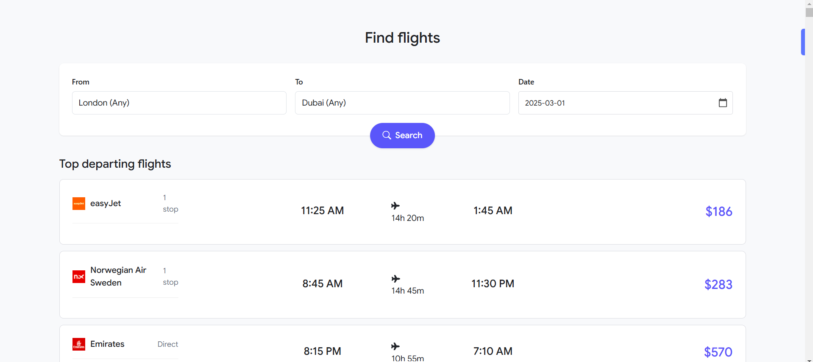

# Flight Search Application

A modern flight search interface built with React that allows users to search for flights between cities with an intuitive and user-friendly design inspired by popular flight booking platforms.

## Demo

[Watch Demo Video](https://www.loom.com/share/eb391f8444bb4ee885ab18b0124ffbb1?sid=4331cd94-2edf-4538-a1df-1d6f87873f69)



## Features

- Real-time airport search with autocomplete
- Flight search with origin, destination, and date selection
- Display of flight results with detailed information:
  - Airline details with logos
  - Flight times and duration
  - Number of stops
  - Pricing information
- Responsive design
- Modern Google Flights-inspired UI
- Loading states and error handling

## Technologies Used

- React.js
- Axios for API requests
- Bootstrap for styling
- React Icons
- Environment variables for API key management


## API Integration

This project uses the Sky-Scrapper API from RapidAPI for:
- Airport search functionality
- Flight search and results

// ... existing README content ...

## API Integration Details

This project utilizes the Sky-Scrapper API from RapidAPI for flight and airport data. Two main endpoints are used:

### Airport Search API
- Endpoint: `sky-scrapper.p.rapidapi.com/api/v1/flights/searchAirport`
- Purpose: Provides airport search functionality with autocomplete
- Features:
  - Real-time airport suggestions as users type
  - Returns airport codes, names, and location details
  - Includes both city and airport information

### Flight Search API
- Endpoint: `sky-scrapper.p.rapidapi.com/api/v1/flights/searchFlights`
- Purpose: Searches available flights between selected airports
- Features:
  - Searches flights based on origin and destination
  - Filters by date and cabin class
  - Returns comprehensive flight details including:
    - Airlines and flight numbers
    - Departure/arrival times
    - Price information
    - Number of stops
    - Duration

Note: A RapidAPI key is required to access these endpoints. Set it in your `.env` file as `REACT_APP_RAPIDAPI_KEY`.


## Acknowledgments

- Design inspired by Google Flights
- Icons provided by React Icons
- Styling framework by Bootstrap

## Getting Started

### Prerequisites

- Node.js (v12 or higher)
- npm or yarn
- RapidAPI key for the Sky-Scrapper API

### Installation

1. Clone the repository:

```bash
git clone https://github.com/yourusername/flight-search-app.git
```

2. Install dependencies

```bash
npm install
```

3. Create a `.env` file in the root directory and add your RapidAPI key:


# Getting Started with Create React App

This project was bootstrapped with [Create React App](https://github.com/facebook/create-react-app).

## Available Scripts

In the project directory, you can run:

### `npm start`

Runs the app in the development mode.\
Open [http://localhost:3000](http://localhost:3000) to view it in your browser.

The page will reload when you make changes.\
You may also see any lint errors in the console.

### `npm test`

Launches the test runner in the interactive watch mode.\
See the section about [running tests](https://facebook.github.io/create-react-app/docs/running-tests) for more information.

### `npm run build`

Builds the app for production to the `build` folder.\
It correctly bundles React in production mode and optimizes the build for the best performance.

The build is minified and the filenames include the hashes.\
Your app is ready to be deployed!

See the section about [deployment](https://facebook.github.io/create-react-app/docs/deployment) for more information.

### `npm run eject`

**Note: this is a one-way operation. Once you `eject`, you can't go back!**

If you aren't satisfied with the build tool and configuration choices, you can `eject` at any time. This command will remove the single build dependency from your project.

Instead, it will copy all the configuration files and the transitive dependencies (webpack, Babel, ESLint, etc) right into your project so you have full control over them. All of the commands except `eject` will still work, but they will point to the copied scripts so you can tweak them. At this point you're on your own.

You don't have to ever use `eject`. The curated feature set is suitable for small and middle deployments, and you shouldn't feel obligated to use this feature. However we understand that this tool wouldn't be useful if you couldn't customize it when you are ready for it.

## Learn More

You can learn more in the [Create React App documentation](https://facebook.github.io/create-react-app/docs/getting-started).

To learn React, check out the [React documentation](https://reactjs.org/).

### Code Splitting

This section has moved here: [https://facebook.github.io/create-react-app/docs/code-splitting](https://facebook.github.io/create-react-app/docs/code-splitting)

### Analyzing the Bundle Size

This section has moved here: [https://facebook.github.io/create-react-app/docs/analyzing-the-bundle-size](https://facebook.github.io/create-react-app/docs/analyzing-the-bundle-size)

### Making a Progressive Web App

This section has moved here: [https://facebook.github.io/create-react-app/docs/making-a-progressive-web-app](https://facebook.github.io/create-react-app/docs/making-a-progressive-web-app)

### Advanced Configuration

This section has moved here: [https://facebook.github.io/create-react-app/docs/advanced-configuration](https://facebook.github.io/create-react-app/docs/advanced-configuration)

### Deployment

This section has moved here: [https://facebook.github.io/create-react-app/docs/deployment](https://facebook.github.io/create-react-app/docs/deployment)

### `npm run build` fails to minify

This section has moved here: [https://facebook.github.io/create-react-app/docs/troubleshooting#npm-run-build-fails-to-minify](https://facebook.github.io/create-react-app/docs/troubleshooting#npm-run-build-fails-to-minify)
